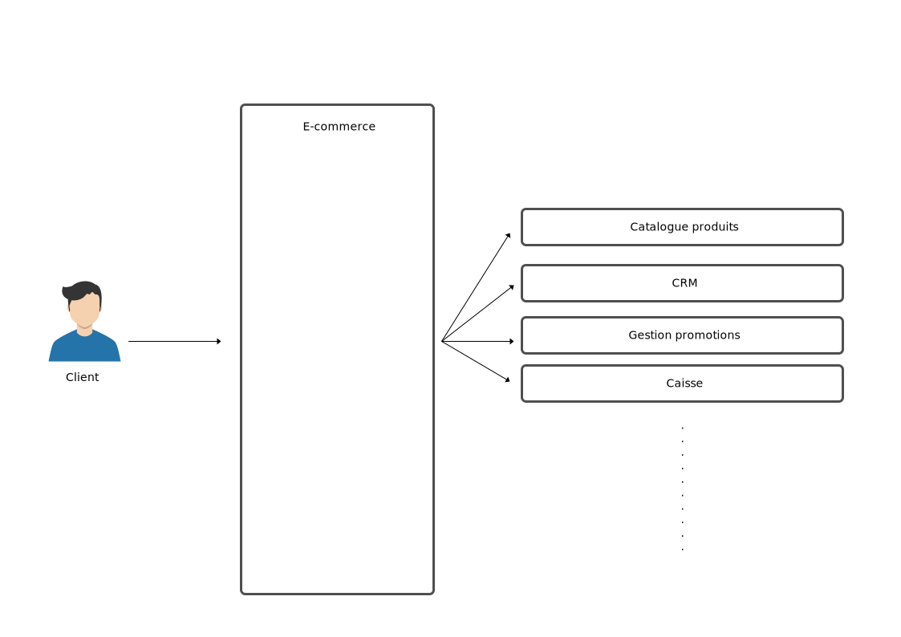

[Sommaire](https://ursi-2020.github.io/e-commerce/)

# Sections

* [API](api.md)
* [Communication](communication.md)
* [Flux](flux.md)
* [Use Case](use-case.md)

# Rôle de l'application E-commerce :rocket:

Le rôle de l'application e-commerce est de faire l'interface entre l'utilisateur et l'ensemble des applications disponibles dans le système d'informations.

