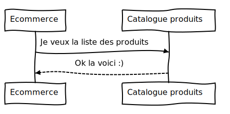

[Sommaire](https://ursi-2020.github.io/e-commerce/)

# Use case E-commerce

## E-commerce -> Catalogue produits

### Récupérer l'ensemble des produits du Catalogue

L'application E-commerce est en charge d'afficher les différents produits à l'utilisateur.
Pour cela, E-commerce récupère les informations auprès du Catalogue Produits.

Ce diagramme de séquence montre comment l'application E-commerce récupère l'ensemble des produits disponibles dans le Catalogue Produits.



L'application E-commerce commence par demander la liste des produits disponibles auprès du Catalogue Produits.
Ce dernier nous renvoie un objet JSON contenant un tableau des produits disponibles.

Appel vers le catalogue:

```python
products = api.send_request("catalogue-produit", "api/data")
data = json.loads(products)
```

Ex de JSON reçu:

```json
{
    produits: [
        {
            id : 1,
            codeProduit: "X1-0",
            descriptionProduit: "Frigos:P1-0",
            familleProduit : "Frigos",
            packaging : 2,
            prix : 424,
            quantiteMin : 15
        }
    ]
}
```

Nous enregistrons ensuite dans notre BDD l'ensemble des produits reçus, à l'aide de ce code:

```python
for produit in data['produits']:
    p = Produit(codeProduit=produit['codeProduit'], familleProduit=produit['familleProduit'],
                descriptionProduit=produit['descriptionProduit'], prix=produit['prix'],
                quantiteMin=1, packaging=0)
    p.save()
```

Nous affichons ensuite le contenu de notre base de données à l'utilisateur via la route:
```
/ecommerce/products
```


## E-commerce -> CRM

L'application E-commerce doit pouvoir avoir l'ensemble des informations clients.
Pour cela, il se connecte alors à l'application CRM pour récupérer toutes les informations clientes.

Ce diagramme de séquence montre comment l'application E-commerce récupère l'ensemble les informations des clients à l'aide de l'application CRM.


E-commerce demande les informations des clients auprès du CRM, à l'aide de la route que l'application met à disposition.