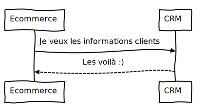

[Sommaire](https://ursi-2020.github.io/e-commerce/)

# Use case E-commerce

## E-commerce -> Catalogue produits

### Récupérer l'ensemble des produits du Catalogue


L'application E-commerce est en charge d'afficher les différents produits à l'utilisateur.
Pour cela, E-commerce récupère les informations auprès du Catalogue Produits.

Ce diagramme de séquence montre comment l'application E-commerce récupère l'ensemble des produits disponibles dans le Catalogue Produits.


L'application E-commerce commence par demander la liste des produits disponibles auprès du Catalogue Produits.
Ce dernier nous renvoie un objet JSON contenant un tableau des produits disponibles.

Appel vers le catalogue:

```python
products = api.send_request("catalogue-produit", "api/data")
data = json.loads(products)
```

Ex de JSON reçu:

```json
{
    produits: [
        {
            id : 1,
            codeProduit: "X1-0",
            descriptionProduit: "Frigos:P1-0",
            familleProduit : "Frigos",
            packaging : 2,
            prix : 424,
            quantiteMin : 15
        }
    ]
}
```

### Enregistrement des données produits

Une fois le JSON reçu, nous enregistrons dans notre BDD l'ensemble des produits, à l'aide de ce code:

```python
for produit in data['produits']:
    p = Produit(codeProduit=produit['codeProduit'], familleProduit=produit['familleProduit'],
                descriptionProduit=produit['descriptionProduit'], prix=produit['prix'],
                quantiteMin=1, packaging=0)
    p.save()
```

Nous affichons ensuite le contenu de notre base de données à l'utilisateur via la route:
```
/ecommerce/products
```

### Vider la BDD Produits

Il est possible de vider le contenu de la base de données Produits de l'application, via le bouton dédié. Nous affichons ensuite la page Produits, qui est alors vide.
Pour cela, au clic sur le bouton, nous déclenchons le code suivant:

```python
models.Produit.objects.all().delete()
product_list = {
    "data" : Produit.objects.all()
}
return render(request, "products.html", product_list)
```

La base de données Produits est alors réinitialisée.

## E-commerce -> CRM

### Récupérer les clients du CRM

L'application E-commerce doit pouvoir avoir l'ensemble des informations clients.
Pour cela, il se connecte alors à l'application CRM pour récupérer toutes les informations clientes.

Ce diagramme de séquence montre comment l'application E-commerce récupère l'ensemble les informations des clients à l'aide de l'application CRM.



E-commerce demande les informations des clients auprès du CRM, à l'aide de la route que l'application met à disposition.
Ce bout de code permet de réupérer les informations:

```python
customers = api.send_request("crm", "api/data")
data = json.loads(customers)
```

### Enregistrer les clients dans la BDD E-commerce

Une fois les clients récupérés, nous les enregistrons dans notre base de données en tant que Customer.

```python
for customer in data:
    customer_tmp = Customer(firstName=customer['firstName'],               lastName=customer['lastName'],                               
        fidelityPoint=customer['fidelityPoint'], payment=customer  ['payment'], account=customer["account"])
    customer_tmp.save()
```

### Affichage de la base de donnnées

A tout moment, il est possible de visualiser le contenu de la base de données clients de l'application E-commerce.
Le code suivant permet de récupérer les informations clients sauvegardés dans la BDD E-commerce:

```python
customer_list = {
    "data" : Customer.objects.all()
}
return render(request, "customers.html", customer_list)
```

Le template HTML utilisé pour afficher les cards:

```

    <div class="customer">
        <div class="picture"></div>
        <div>
            <p><span style="color: gray">Prénom<br></span> {{ customer.firstName }}</p>
            <p><span style="color: gray">Nom de famille<br></span> {{ customer.lastName }}</p>
            <p><span style="color: gray">Points de fidélité<br></span> {{ customer.fidelityPoint }}</p>
        </div>
    </div>

```

### Effacer la base de données clients

Il est possible de vider la base de données clients de l'app E-commerce à l'aide d'un bouton.
Le code suivant est alors déclenché:

```python
models.Customer.objects.all().delete()
customers_list = {
    "data" : Customer.objects.all()
}
return render(request, "customers.html", customers_list)
```


## Scheduler

### Principe

L'application E-commerce met en place le système de scheduler.
Le scheduler permet de programmer différentes tâches à effectuer, à une heure précise.
Il existe deux tâches programmables à l'heure actuelle: récupérer les données clients, et récupérer les données du catalogue produit.

### Récupération des informations du scheduler

La page du scheduler affiche à tout moment la date et l'heure actuel de la clock.
Il indique également la vitesse de celle-ci.

Nous récupérons également l'ensemble des tâches programmées par le scheduler, afin de les afficher dans un tableau.

Pour cela, nous utilisons le code suivant:

```python
info = api.send_request("scheduler", "clock/info")
tasks = api.send_request("scheduler", "schedule/list")
info = json.loads(info)
info = {
    "data" : info,
    "tasks" : tasks
}
return render(request, "scheduler.html", info)
```

### Ajouter une tâche au scheduler

Pour pouvoir ajouter une tâche au scheduler, nous avons créé un formulaire dédié.
Il suffit d'indiquer l'application dont on souhaite récupérer les données, indiquer une date et une heure ainsi qu'une récurence.
La tâche est alors enregistrée puis executée à l'heure indiquée.

```python
data = request.POST.dict()
time = datetime.strptime(data["time"], '%Y-%m-%dT%H:%M')
host = ""
recurrence = data["recurrence"]
url = ""
source = "e-commerce"
name = "get_customers"
data2 = ""
if data["app"] == "products":
    host = "e-commerce"
    url = "ecommerce/add-auto"
    name = "get_products"
elif data["app"] == "crm":
    host = "e-commerce"
    url = "ecommerce/auto_load_customers"
    name = "get_customers"
schedule_task(host, url, time, recurrence, data2, source, name)
```